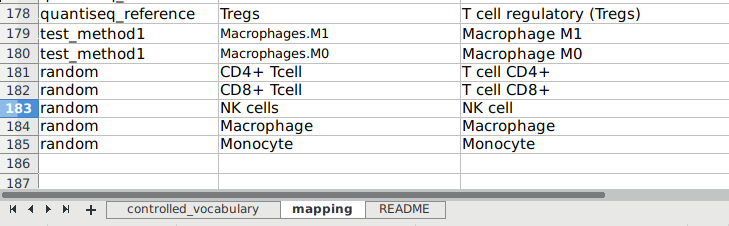

# Comprehensive evaluation of cell-type quantification methods for immuno-oncology

Sturm, Finotello et al. (2018), biorXiv, https://doi.org/10.1101/463828

The source code in this project can be used to reproduce the results
described in the paper. Additionally, the pipeline can be easily
extended to test novel methods against the state-of-the art.

Running the pipeline will generate an interactive HTML report using
[bookdown](https://bookdown.org/yihui/bookdown/), which is equivalent
to the one available on
[grst.github.io/immune_deconvolution_benchmark](https://grst.github.io/immune_deconvolution_benchmark)

**All (preprocessed) data needed to reproduce the results**:
[data.tar.gz](https://github.com/grst/immune_deconvolution_benchmark/releases/download/v1.0.0-rc1/data.tar.gz)

## Getting started
Short version:
```
conda install -c conda-forge snakemake
git clone --recurse-submodules git@github.com:grst/immune_deconvolution_benchmark.git
cd immune_deconvolution_benchmark
#<add CIBERSORT source code; see below (optional)>
snakemake get_cache  # download some precomputed files to speed up the build process (optional)
snakemake --use-conda
```

For details, see below.

If you have trouble running the pipeline first, see the [FAQ](#FAQ) then report an issue on GitHub. 

### Prerequisites
This pipeline uses [Anaconda](https://conda.io/miniconda.html) and
[Snakemake](https://snakemake.readthedocs.io/en/stable/).

1. **Download and install [Miniconda](https://conda.io/miniconda.html)**
2. **Install snakemake**
```
conda install snakemake
```

3. **Clone this repo.** We use a [git submodule](https://git-scm.com/docs/git-submodule) to import
the source code for the [immundeconv](https://github.com/grst/immunedeconv) R package.
```
git clone --recurse-submodules git@github.com:grst/immune_deconvolution_benchmark.git
```

If you have problems retrieving the submodule, read this [question on
stackoverflow](https://stackoverflow.com/questions/3796927/how-to-git-clone-including-submodules).


### CIBERSORT
Due to licensing restrictions, CIBERSORT could not be included in this repo.
You have to go to the [CIBERSORT website](https://cibersort.stanford.edu),
obtain a license and download the source code.

Place the files `CIBERSORT.R` and `LM22.txt` in the
```
libs/CIBERSORT/
```
folder of this repository.

Alternatively, you can adjust the paths in `notebooks/config.R`

If CIBERSORT is not available, it will automatically be excluded from the
analysis (see `notebooks/config.R` for more details).


### Computational resources and caching
Running the full pipeline can take a lot of time and computational resources.
In particular the sensitivity and specificity analysis do a lot of simulations.

The pipeline internally generates caches to speed up repetitive builds.
To eradicate all caches, use
```
snakemake wipe
```

By default, the pipline uses up to 16 cores and requires up to 12GB of
memory per core. You can adjust the number of cores in [notebooks/config.R](https://github.com/grst/immune_deconvolution_benchmark/blob/ce5684bae11a16784547b00719f1ab51795dbf2c/notebooks/config.R#L3).

The runtime of the pipeline can be several hours, depending on the number of cores.


### Run the pipeline
To perform all computations and to generate a HTML report with
[bookdown](https://bookdown.org/yihui/bookdown/) invoke
the corresponding `Snakemake` target:

```
snakemake --use-conda book
```

Make sure to use the `--use-conda` flag to tell Snakemake to download all dependencies from Anaconda.org.

The pipeline will generate a `results` folder.
The HTML report with all figures and results will be available in
`results/book`.


### Useful Snakemake targets.
Have a look at the `Snakefile`, it is self-explanatory.

A list of the most useful targets
```
snakemake --use-conda book       # generate a HTML-book in `results/book`
snakemake --use-conda            # default target (= book)
snakemake clean                  # cleans the HTML book
snakemake wipe                   # cleans everything, including all caches.
snakemake get_cache              # downloads precomputed results for sensitivity and specificity
```

## FAQ
### 1. The pipeline fails with a weird error message. 
A likely reason for that is that you don't have enough RAM per core. Try to reduce the maximum number of cores in [notebooks/config.R](https://github.com/grst/immune_deconvolution_benchmark/blob/ce5684bae11a16784547b00719f1ab51795dbf2c/notebooks/config.R#L3) until you have at least 12GB of RAM per core. 

This happens when the pipeline breaks out of a parallel for loop. A possible error message is 
```
Error in names(object) <- nm : 
  'names' attribute [10] must be the same length as the vector [0]
Calls: <Anonymous> ... getResult -> getResult.iforeach -> <Anonymous> -> setNames
```
which does not really hint at a lack of memory. Others might be possible if the pipeline fails at other stages. 

### 2. Can I test my own method?
Yes, you need to write a small wrapper function. 
See [below](#test-your-own-method). 

### 3. Can I use my own dataset (FACS or scRNA-seq) in the pipeline?
No, not out-of-the-box. 
Feel free to use the Rmarkdown notebooks in [notebooks](notebooks) as a template. It should be fairly easy
to edit them e.g. in Rstudio and adjust the datasets. 


## Test your own method

Our pipeline is designed in a way that you can easily test your own method and benchmark it against the
state-of-the-art. All you have to do is to write an `R` function within the `immunedeconv` package that calls your
method.

Here we demonstrate how to implement and test a method step-by-step using a nonsense random predictor.

In brief, this is what we need to do:

1. Add the new method to the `immunedeconv` package
2. Map the output cell types of the method to the controlled vocabulary
3. Adjust pipeline configuration (optional)
4. Run the pipeline

### Add the new method to the `immunedeconv` package
The sourcecode of the `immunedeconv` package is located in `./immunedeconv`. The pipeline always loads this package from the source code there.

1. **Go to the package and checkout a new branch**

```bash
cd immunedeconv
git checkout -b new_method
```

2. **Edit the file `R/immune_deconvolution_methods.R`**

First, we add our method to the 'list of supported methods'.
The first value corresponds to the "display name", that will be shown in
the report, the second value to the internal name of the method that
will later be passed to the `deconvolute()` function.

```r
deconvolution_methods = c("MCPcounter"="mcp_counter",
                          "EPIC"="epic",
                          "quanTIseq"="quantiseq",
                          "xCell"="xcell",
                          "CIBERSORT"="cibersort",
                          "CIBERSORT (abs.)"="cibersort_abs",
                          "TIMER"="timer",
                          "random pred."="random") # <- method added here
```

Next, we add a new deconvolution function for our method.

* Input: gene expression matrix (cols = samples, rows = genes, rownames = HGNC symbols, colnames = sample names)
* Output: A matrix with immune cell estimates (cols = samples, rows = cell types,
rownames = cell type name, colnames = sample names from input)

Note that you can use `system()` to call an arbitrary command line tool.

In our case, we add
```r
#' Deconvolute using the awseome RANDOM technique
#'
#' Here is a good place to add some documentation.
deconvolute_random = function(gene_expression_matrix) {
  # list of the cell types we want to 'predict'
  cell_types = c("CD4+ Tcell", "CD8+ Tcell", "NK cell", "Macrophage",
                 "Monocyte")
  n_samples = ncol(gene_expression_matrix)

  # generate random values
  results = matrix(runif(length(cell_types) * n_samples), ncol=n_samples)

  # rescale the values to sum to 1 for each sample
  results = apply(results, 2, function(x) {x/sum(x)})
  rownames(results) = cell_types
  colnames(results) = colnames(gene_expression_matrix)

  results
}
```

Finally, register the new method in the generic `deconvolute()` function.
```r
deconvolute = function(gene_expression, method=deconvolution_methods, indications=NULL) {
  message(paste0("\n", ">>> Running ", method))
  # run selected method
  res = switch(method,
         xcell = deconvolute_xcell(gene_expression),
         mcp_counter = deconvolute_mcp_counter(gene_expression),
         epic = deconvolute_epic(gene_expression),
         quantiseq = deconvolute_quantiseq(gene_expression),
         cibersort = deconvolute_cibersort(gene_expression, absolute = FALSE),
         cibersort_abs = deconvolute_cibersort(gene_expression, absolute = TRUE),
         timer = deconvolute_timer(gene_expression, indications=indications),
         random = deconvolute_random(gene_expression)   # <- method added here
         )

  # convert to tibble and annotate unified cell_type names
  res = res %>%
    as_tibble(rownames="method_cell_type") %>%
    annotate_cell_type(method=method)

  return(res)
}
```

To check everything, run the unit tests of the `immunedeconv` package.
Invoke the following command from the root of the main repository:
```bash
snakemake --use-conda test_immunedeconv
```

Note that the tests can take some while, and warnings regarding the convergence of EPIC are expected.


### Map the output cell types to the controlled vocabulary
Open the file `immunedeconv/inst/extdata/cell_type_mapping.xlsx` in Excel or
OpenOffice.

Map the cell types to the controlled vocabulary.
* The first column corresponds to the method name
* The second column (`method_cell_type`) corresponds to the cell types, as
  named by the method
* The third column (`cell_type`) corresponds to the corresponding cell type
  entity from the controlled vocabulary.




### Adjust pipeline configuration (optional)
Have a look at the configuration file:
```
notebooks/config.R
```

Here, we can specify where our new random method will be used in 
the benchmark. We add our random predictor to the set of methods that
will be benchmarked in terms of *absolute deviations* from the
real score (not supported by all methods):

```r
############## Specify methods used in the benchmark ##################

# these methods will be used in the benchmark. Default: Use all methods
# provided by the `immundeconv` package. 
config$deconvolution_methods = immunedeconv::deconvolution_methods

# these methods will be treated as 'absolute' methods in the mixing benchmark
config$abs_methods_mixing = c("cibersort_abs", "epic", "quantiseq", "xcell", "random")

# these methods will be shown as 'absolute' methods in the validation benchmark
config$abs_methods_validation = c("cibersort_abs", "quantiseq", "epic", "random")

# these methods provide scores that support within-sample comparisons
config$methods_within_sample_comparison = c("cibersort", "cibersort_abs", "quantiseq", "epic")
```

### Run the pipeline

```bash
snakemake wipe   # use this command to clear up previous results and to eradicate the cache
snakemake --use-conda book
```
